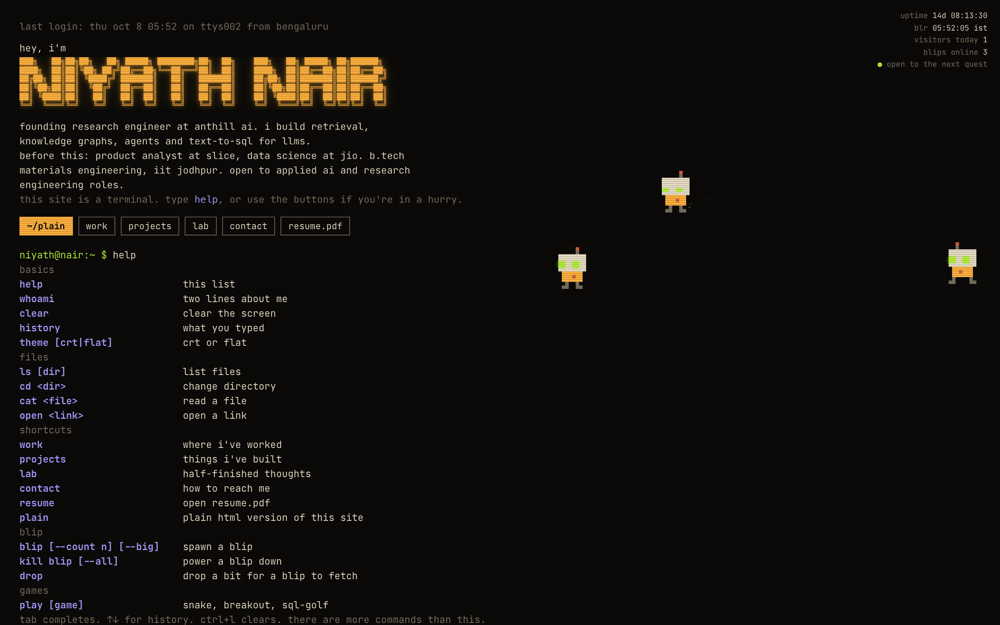

# niyath.nair, the terminal

my personal site. it works like a terminal: type commands, or click the buttons. a small pixel robot called **blip** lives on the page, wanders around, and fetches pieces of my work when you drop bits for it.

live: https://nsquaredzz.github.io



## run it

```bash
npm install
npm run dev        # http://localhost:5173
npm run build      # type-checks, then builds to dist/
npm run preview    # serves dist/
```

vite + vanilla typescript, no framework. the production bundle is about 22 kb of js gzipped.

useful urls while developing:

- `/?plain` plain html version (also reachable with `exit`, `plain`, or the `~/plain` button)
- `/?blips=3` spawn blips on load
- `/?help` force the first-visit `help`

## layout

```
src/
  main.ts              wires everything together, first screen, buttons, chips
  content.json         everything you read on the site. edit this, not the code
  banner.ts            the ascii name banner
  status.ts            uptime, blr clock, visitors, blips online
  plain.ts             the semantic html version
  paper.ts, paper.css  the paper-style page used by blog posts
  style.css            one stylesheet, one font, seven colours
  terminal/
    terminal.ts        output, prompt, history, tab completion, boxes
    parser.ts          "cmd arg --flag value" -> { cmd, args, flags }
    fs.ts              a read-only filesystem built from content.json
    commands.ts        the command registry, including the hidden ones
  sprite/
    sprite.ts          blip's pixels and how to draw them
    engine.ts          requestAnimationFrame loop, steering, bits, bubbles
posts/                 blog posts as markdown, one file per post
scripts/build-posts.mjs  markdown + LaTeX -> blog/<slug>/index.html and src/generated/posts.json
public/
  blog/<slug>/         figures for a post
  fonts/               jetbrains mono, self-hosted
  resume.pdf           what the resume button opens. replace the file to update it
```

## add content

everything on the site comes from `src/content.json`.

- `dirs.work`, `dirs.projects`, `dirs.lab`, `dirs.notes`: each entry is a file. `name` is what `ls` shows, `title`/`when`/`tag` show in listings and box titles, `body` is a list of lines. a line starting with `# ` is the heading, `- ` is a bullet, an empty line is a paragraph gap. `[label](url)` makes a link, backticks make inline code.
- `intro`: the labelled rows under the banner on the first screen. `bio` is the prose version used by `whoami` and plain mode.
- `hidden`: dotfiles that only show up with `ls -a`.
- `fetchable`: the paths blip can bring back when it fetches a bit.
- `email`, `linkedin`, `github`: shown by `contact`, `sudo hire niyath`, the side pane and plain mode.
- `firstCommit`: what `uptime` counts from.

no code changes needed. the plain version renders from the same file.

## write a blog post

posts are markdown files in `posts/`. each one becomes a paper-style page at `/blog/<filename>/`, a file in `~/blog/` inside the terminal, and an entry in the `blog` command and the side pane.

```
---
title: A title
subtitle: One line under the title.
date: 2026-10-08
tag: research
summary: Two sentences. Shown in the terminal and on the blog index.
---

:::abstract
The abstract.
:::

## A section

Inline maths $e^{i\pi} = -1$ and display maths:

$$ \lVert g - h \rVert_\infty $$

:::theorem Theorem 1 (name).
Statement.
:::

:::proof
Argument.
:::

:::tbl **Table 1.** A caption.
| a | b |
|---|---|
| 1 | 2 |
:::


```

- maths is LaTeX, rendered to html by katex at build time. no maths javascript is shipped. a typo in the LaTeX fails the build with the offending snippet.
- blocks: `abstract`, `theorem`, `proposition`, `lemma`, `definition`, `proof`, `remark`, `note`, `tbl`.
- `##` and `###` headings are numbered automatically and `##` headings make the contents list. figures are numbered automatically.
- `draft: true` in the front matter keeps a post out of the build.
- `npm run posts` regenerates the pages. `npm run dev` and `npm run build` run it first. the generated `blog/` and `src/generated/` folders are not committed.

the page template and the markdown handling are in `scripts/build-posts.mjs`. the look is `src/paper.css`.

## add a command

commands live in `src/terminal/commands.ts` as one object each:

```ts
{
  name: "hello",
  desc: "say hi",            // shown in help
  usage: "hello [name]",     // optional, replaces name in help
  group: "basics",           // which help box it lands in
  hidden: false,             // true keeps it out of help (secret commands)
  run(p, ctx) {
    ctx.term.text(`hi ${p.args[0] ?? "there"}`);
  },
}
```

`p` is the parsed line (`args`, `flags`, `raw`). `ctx` has the terminal (`print`, `text`, `openBox`/`closeBox`), the filesystem, and the blip engine (`spawn`, `kill`, `drop`, `panic`, `say`). tab completion for a command's arguments is in `main.ts` in `onComplete`.

## blip

12x12 pixels, drawn on one fullscreen canvas. the engine keeps blips in a rectangle that `main.ts` computes: right of the text column on desktop, a strip above the chips on mobile. steering is three rules: wander to a random point, avoid other blips, go to the nearest unclaimed bit. with `prefers-reduced-motion` they sit still and blink.

## deploy

### github pages (this repo)

pushing to `main` runs `.github/workflows/deploy.yml`, which builds and publishes `dist/` to github pages. the repo is named `nsquaredzz.github.io` so the site lives at the root of that domain.

### vercel

```bash
npm i -g vercel
vercel          # framework: vite, build: npm run build, output: dist
```

or import the repo in the vercel dashboard. no config file is needed. if you move the site to a subpath anywhere, set `base` in `vite.config.ts`.

## colours

bone `#e9dfc8`, dim `#7a7160`, amber `#ffb23e`, green `#b6f23a`, lilac `#a99cff`, rust `#d9643a`, on warm black `#0b0a08`. nothing else.
